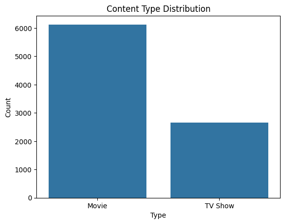
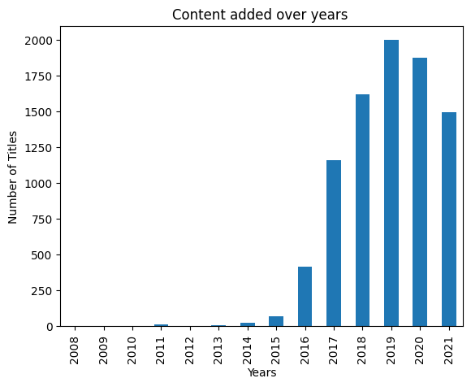
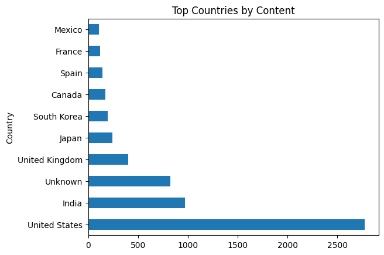

# Netflix EDA Project 🎬

In this project, we analyze Netflix's content library using Exploratory Data Analysis (EDA) to uncover patterns related to content type, release year, country distribution, and more using Python and visualization tools.

## 📁 Dataset
- **Source**: [Kaggle - Netflix Shows Dataset](https://www.kaggle.com/datasets/shivamb/netflix-shows)
- **Rows**: ~8800 titles
- **Columns**: Show ID, Title, Type (Movie/TV Show), Director, Cast, Country, Date Added, Release Year, Rating, Duration, Genre, Description

## 🔗 Notebook
[Click here to view the notebook](./Netflix.ipynb)

## 🎯 Objectives
- Handle missing values smartly
- Clean and preprocess the dataset
- Extract meaningful insights
- Visualize data effectively using Seaborn and Matplotlib

## 📈 Key Insights
- Majority content type: **Movies**
- Peak growth: **2017 to 2020**
- Top content production countries: **USA and India**
- Popular genres: **International Movies, Drama, Comedies**

# 📊 Visual Explorations

## 📹 Content Type Distribution
This plot highlights the Content Type Distribution across Netflix content.


## 📅 Year-wise Content Addition
This plot highlights the Year wise Content Addtion across Netflix content.


## 🌍 Country-wise Content Distribution
This plot highlights the Country wise Content Production across Netflix content.


## 📚 Genre-wise Distribution
This plot highlights the most common genres/categories across Netflix content.


## 🛠️ Tools & Libraries Used
- Python
- Pandas
- Matplotlib
- Seaborn
- Jupyter Notebook

## ✅ Setup Instructions

1. **Clone this repo**:
   ```bash
   git clone https://github.com/your-username/netflix-eda-project.git
   cd netflix-eda-project

2. **Create virtual environment**:
    ```bash
    python -m venv venv
    source venv/bin/activate      # For Mac/Linux
    venv\Scripts\activate         # For Windows

3. **Install Dependencies**:
    ```bash
    pip install -r requirements.txt

4. **Launch Notebook**:
    ```bash
    jupyter notebook

## ⭐ Support
If you found this project helpful, consider giving it a ⭐. It helps others discover it and motivates me to continue learning and building!

## 🙋‍♂️ About Me
**Samarth Mishra**  
Aspiring Data Analyst | Mobile App Developer (Flutter, iOS, Android)
🔗 [LinkedIn](https://www.linkedin.com/in/samarth-mishra-1274a8278/)  
📧 samarth.mishra0305@gmail.com
